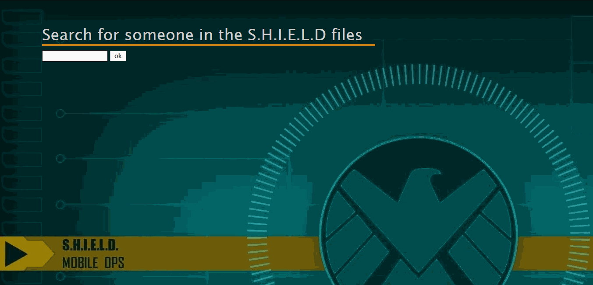

# Marvel-API-Project
An API challenge built in the algorythm classes in the technical course on SENAI school.

In the input tag it's possible to write an initial name or letters to find characters that starts the name with.

As return, it shows the name, a thumbnail and the description of the character, all extracted from the Marvel API in the developer portal: https://developer.marvel.com/. 

The exibition occurs in a carousel slider build with jQuery and Bootstrap classes.

Version: 1.0

Creation: 13/04/2019

*Everything made with a lot of curiosity and programming passion* 
